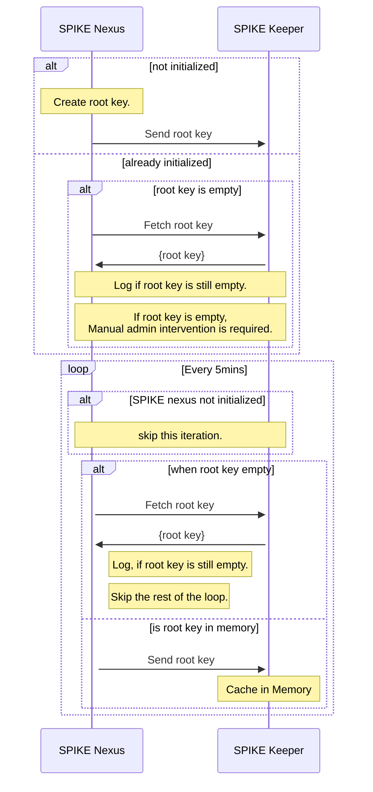
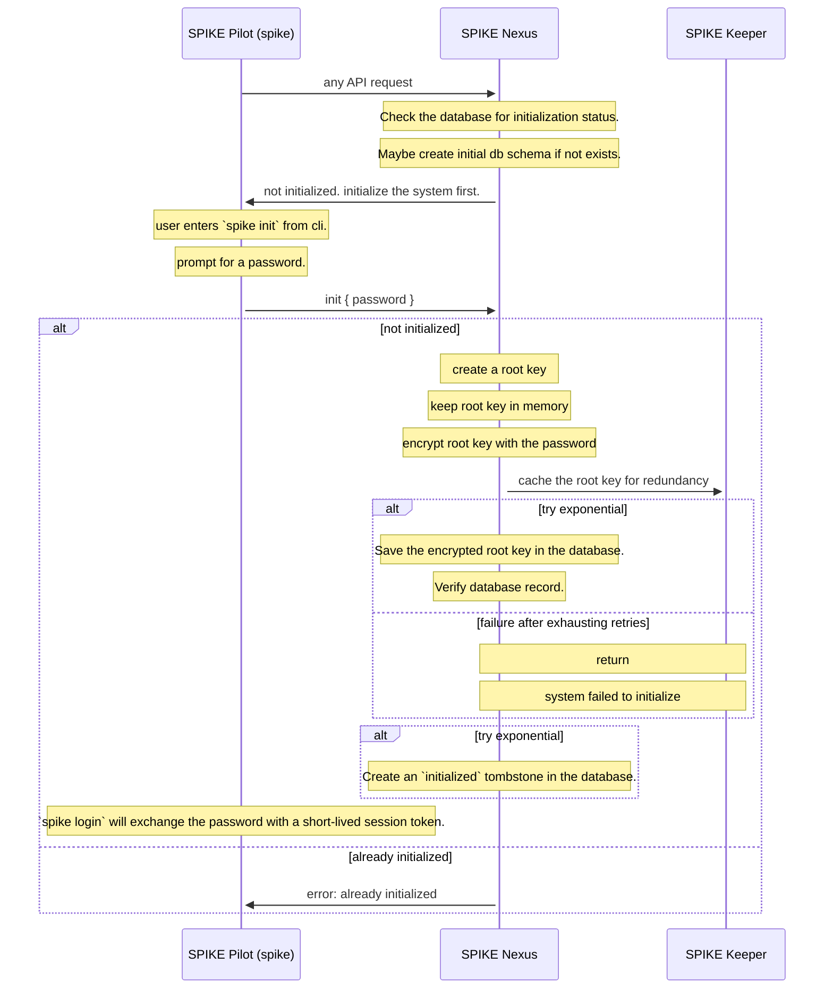
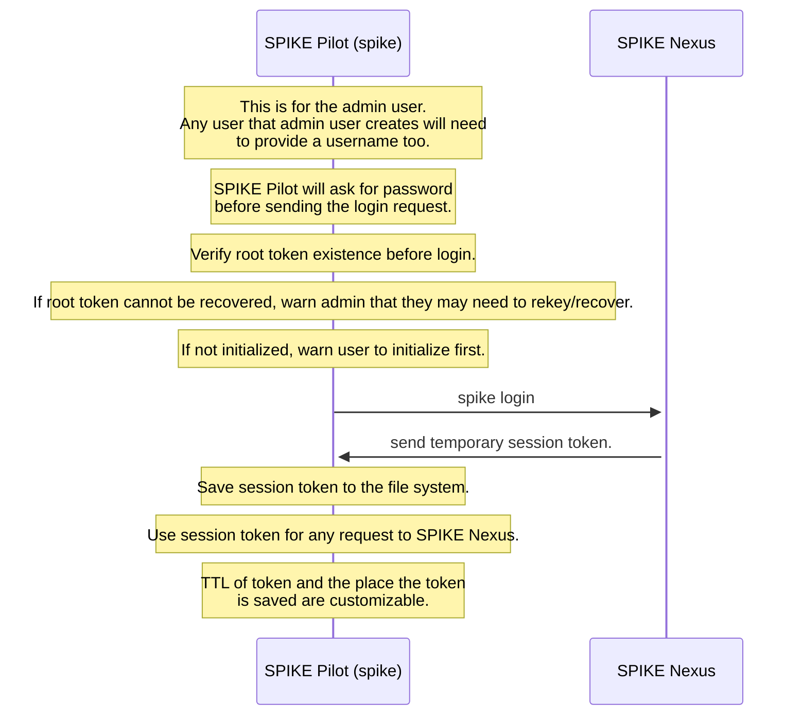
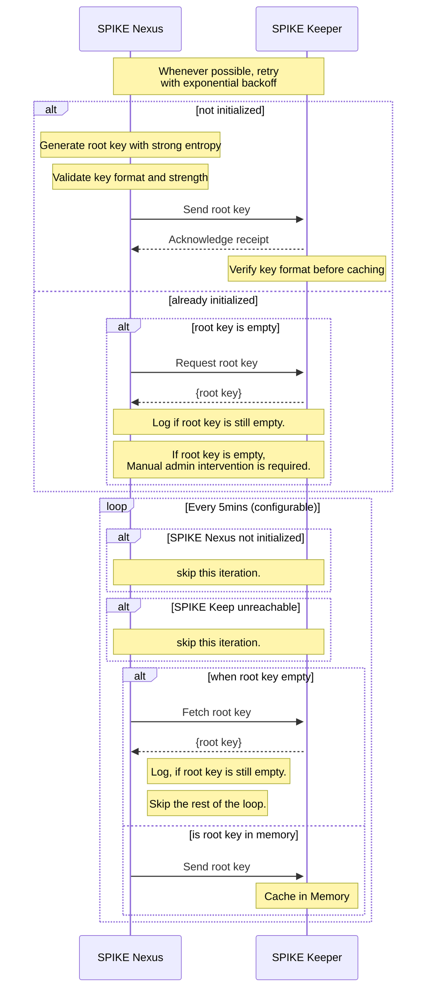
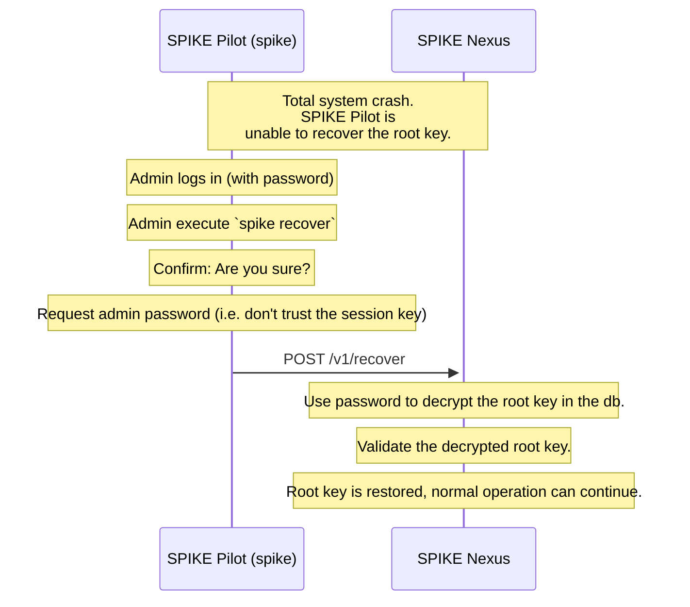
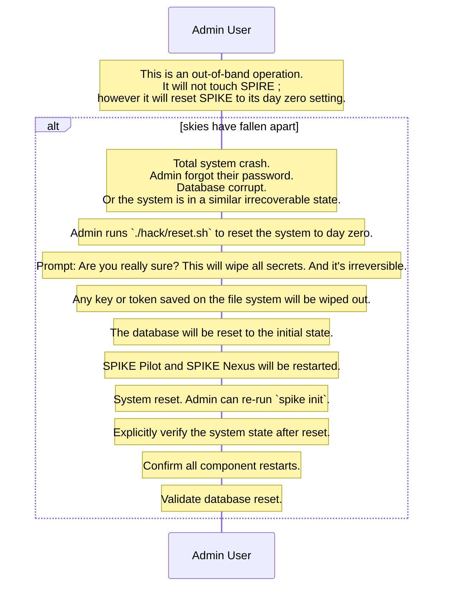

```txt
  \\ 
 \\\\ SPIKE: Keep your secrets secret with SPIFFE.
\\\\\\
```

## SPIKE Design Document

SPIKE (Secure Production Identity for Key Encryption) is a secrets management
system build on top of a SPIFFE identity control plane, consisting of three
components:

* **SPIKE Nexus** (./nexus)
* **SPIKE Pilot** (./spike)
* And **SPIKE Keeper** (./keeper)

The system provides high availability for secret storage with a manual recovery
mechanism in case of irrecoverable failure.

## Components

### SPIKE Nexus

* **SPIKE Nexus** is the primary component responsible for secrets management.
* It creates and manages the root encryption key.
* It handles secret encryption and decryption.
* It snycs to root encryption key with **SPIKE Keeper** regularly.
* It provides an admin interface for key management.

### SPIKE Keeper

* It is designed to be simple and reliable.
* Its only goal is to keep a copy of the root key in memory.
* It enables automatic recovery if **SPIKE Nexus** crashes.
* It is co-located with **SPIKE Nexus** (on the same machine/node).

### SPIKE Pilot

* It is the CLI to the system.
* It converts CLI commands to RESTful mTLS API calls to **SPIKE Nexus**.
* It is the only management entry point to the system.
* Deleting/disabling/removing **SPIKE Pilot** reduces the attack surface
  of the system since admin operation will not be possible without
  **SPIKE Pilot**.

### SPIKE Mint

**SPIKE Mint** is a standalone utility for generating initialization tokens.
It creates cryptographically secure tokens with metadata:

**Features**:
* 256 bits of entropy per token
* Version tracking
* Creation timestamp
* Purpose field
* Optional expiry
* HMAC-based integrity verification
* Base64 encoded for transport
* CLI interface for admin usage
* Can validate existing tokens
* Ensures standardization of token format and security

## Security Model

### Authentication and Communication

* All inter-component communication is secured through SPIFFE mTLS.
* Components identify each other using their SVIDs.
* Network-level security is provided by SPIFFE mTLS.

### Trust Boundaries

* Primary trust boundary is at the machine level.
* If **SPIKE Keeper** is compromised, the machine is considered compromised.
* Both **SPIKE Nexus** and **SPIKE Keeper** are hardened. They use distroless
  containers to prevent various attack vectors.
* The design assumes (*but does not mandate*) a containerized environment
  (*such as Docker or Kubernetes*). If containerization is not possible, 
  components can still work identically, assuming they can establish
  SPIFFE mTLS securely.
* Physical, and OS-level security are important.

## Key Management

* The system assumes a long-lived, well-guarded, initial root key.
* The root key is automatically generated by **SPIKE Nexus** and it's
  **never** store on disk in plain text (*i.e., it alwyas lives in 
  memory*)
* An administrator (*through SPIKE Pilot*) can provide a public key for
  encrypted root key backup.
* Key rotation will also re-encrypt secrets.

## Administrative Access

* Initial provisioning requires an admin initialization token.
* The token is generated using **SPIKE Mint**
* Token used for first-time setup and root key creation
* While machine access could technically bypass controls, token provides:
  * Audit trail of initialization
  * Protection against accidental re-initialization
  * Privilege separation between system and security administrators
  * Integration point for automation and IaC

## Multi-Admin Support

* Initial admin uses **SPIKE Mint** to create the first initialization token.
* Additional admins can be authorized through token management API.
* Each admin can have their own valid token.

Token operations:
* Add new admin token (requires existing admin authorization)
* Remove admin token
* List admin tokens (metadata only)
* Validate token status

Benefits:
* Support for multiple administrators
* Emergency access procedures
* Token revocation capabilities
* Clear audit trail of admin access

## Recovery

### SPIKE Nexus Crash Recovery

1. **SPIKE Nexus** crashes.
2. New **SPIKE Nexus** instance starts.
3. **SPIKE Nexus** authenticates to SPIKE Keeper using SPIFFE mTLS.
4. **SPIKE Keeper** provides the root key over mTLS.
5. **SPIKE Nexus** resumes normal operation.

### Complete System Recovery

1. Both **SPIKE Nexus**, **SPIKE Keeper** are unavaiable, or the system is
  in on other irrecoverable state.
2. Admin retrieves encrpted root key.
3. Admin decrypts the root key using their private key.
4. Admin reinitializes **SPIKE Nexus** using the decrypted root key.
5. The system resumes normal operation.

## Data Consistency

* If the root key changes during recovery, the old encrypted data becomes
  invalid.
* Securely backing up the root key is critical for data consistency and
  recovery.

## Monitoring and Observability

### Health Metrics

* Basic health, liveness, readiness probes for all components.
* Prometheus integration for metrics collection.

### Key Metrics

* Number of secrets stored.
* Memory utilization.
* Failed authentication attempts.
* Time since last Nexus-Keeper snyc.
* Root key age

## Future Considerations

### Potential Enhancements

* Automated key rotation
* Multiple Keeper instances for redundancy
* Various backing stores (file system, postgres, cloud secrets store)
* Key versioning for tracking encryption history

### Additional Monitoring

* Advanced authentication metrics
* Key usage statistics
* Performance metrics for crypto operations.

## Security Recommendations

* Use filesystem encryption
* Regular security audits for machines and key components
* Strict access control
* Regular backup verification of encrpted root key
* Monitoring for anomalies and unusual access patterns

## Architecture Decision Records

The [`./adrs`](adrs) folder contains Architecture Decision Records for the
project.

## Sequence Diagrams 

### SPIKE Nexus Root Key Provisioning and Recovery



### SPIKE Initialization



### SPIKE Login



### SPIKE Nexus Automatic Recovery After Crash



### SPIKE Manual System Re-Initialization



### SPIKE Forced Root Key Reset

This will make all the stored secrets obsolete, so it should be done
as a last resort. This may be required in cases where the database has been
corrupted, or the admin user has lost access to their password manager
(we hope that they don't memorize passwords, and they have more trusted ways
of keeping random long-lived passwords elsewhere, like system keyring, or a 
password manager).



## SPIKE Database Usage

**SPIKE Nexus** is the only client for the backing store (*Postgres DB*).

Here are the things **SPIKE Nexus stores in the db.

* **root key** (*encrypted with the admin password*)
* **admin token** (*encrypted with the root key*)
* **session keys** (*encrypted with the root key*)
* **secrets** (*encrypted with the root key*)

Note that both **admin token**, **session keys**, and **secrets**, are a kinds 
of secrets from the data storage perspective.

Also note that **SPIKE Pilot** (i.e. `spike`) can save temporary session keys
and encrypted admin tokens on disk for convenience. Whereas **SPIKE Nexus** 
will either store things in memory or keep them encrypted in a database, **never**
saving anything on the file system.

## SPIKE Data Model

Here is an initial data model (*subject to change during implementation*)

Note that for simplicity, we'll initially only support **Postgres** as a
backing store.

```sql
-- Enable UUID generation
CREATE EXTENSION IF NOT EXISTS "uuid-ossp";

-- Enum for different types of secrets
CREATE TYPE secret_type AS ENUM ('admin_token', 'session_key', 'secret');

-- Store the root key (encrypted with admin password)
CREATE TABLE root_keys (
    id uuid PRIMARY KEY DEFAULT uuid_generate_v4(),
    encrypted_key bytea NOT NULL,
    key_hash bytea NOT NULL,  -- For verification
    created_at timestamp with time zone DEFAULT CURRENT_TIMESTAMP,
    last_rotated_at timestamp with time zone,
    active boolean DEFAULT true,
    CONSTRAINT single_active_key UNIQUE (active)
);

-- Store all types of secrets (encrypted with root key)
CREATE TABLE secrets (
    id uuid PRIMARY KEY DEFAULT uuid_generate_v4(),
    name varchar(255) NOT NULL,
    type secret_type NOT NULL,
    encrypted_data bytea NOT NULL,
    metadata jsonb,  -- For additional secret-specific data
    created_at timestamp with time zone DEFAULT CURRENT_TIMESTAMP,
    updated_at timestamp with time zone DEFAULT CURRENT_TIMESTAMP,
    expires_at timestamp with time zone,
    version integer DEFAULT 1,
    previous_version_id uuid REFERENCES secrets(id),
    CONSTRAINT unique_active_name UNIQUE (name, type)
);

-- Audit log for all operations
CREATE TABLE audit_logs (
    id uuid PRIMARY KEY DEFAULT uuid_generate_v4(),
    operation varchar(50) NOT NULL,
    secret_id uuid REFERENCES secrets(id),
    metadata jsonb,
    performed_at timestamp with time zone DEFAULT CURRENT_TIMESTAMP
);

-- Create indexes for better performance
CREATE INDEX idx_secrets_type ON secrets(type);
CREATE INDEX idx_secrets_name ON secrets(name);
CREATE INDEX idx_audit_logs_secret_id ON audit_logs(secret_id);
CREATE INDEX idx_audit_logs_performed_at ON audit_logs(performed_at);

-- Add triggers for updating 'updated_at' timestamp
CREATE OR REPLACE FUNCTION update_updated_at_column()
RETURNS TRIGGER AS $$
BEGIN
    NEW.updated_at = CURRENT_TIMESTAMP;
    RETURN NEW;
END;
$$ language 'plpgsql';

CREATE TRIGGER update_secrets_updated_at
    BEFORE UPDATE ON secrets
    FOR EACH ROW
    EXECUTE FUNCTION update_updated_at_column();
```
